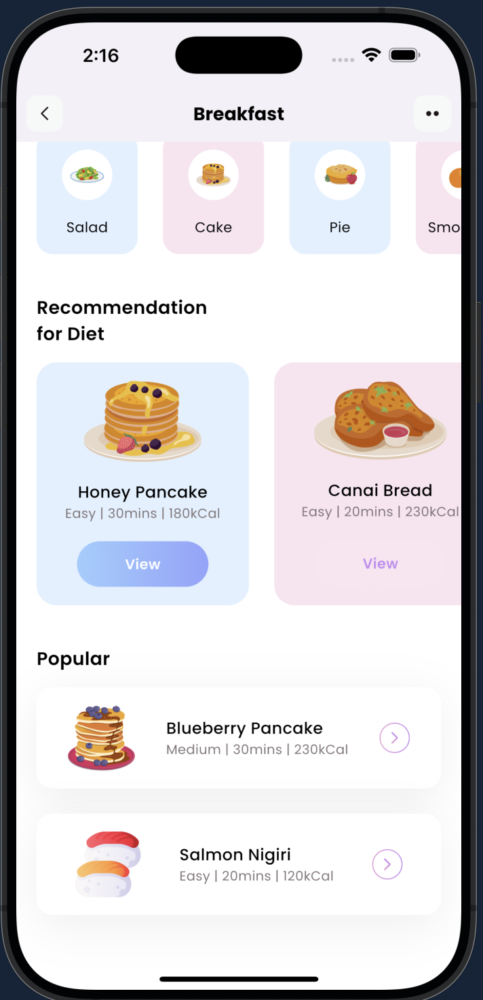

# Fitness App (Flutter)

A simple Flutter app to browse breakfast recipes and diet tips with a clean, modern UI.

## 🚀 Features
- Browse breakfast categories
- View diet details (level, duration, calories)
- Explore popular meals with icons
- Search for specific meals
- Responsive, modern design

## 🖼️ Screenshot



## 🛠 Getting Started

### Prerequisites
- [Flutter SDK](https://flutter.dev/docs/get-started/install)
- Dart (bundled with Flutter)
- IDE (VS Code, Android Studio, etc.)

### Installation
```bash
git clone https://github.com/yourusername/freshflutterapp.git
cd freshflutterapp
flutter pub get
flutter run
